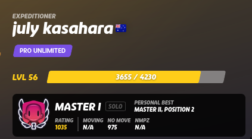

## Hi there, I'm Harry (he/him) 👋

I'm currently studying at the University of Melbourne, majoring in Computing and Software Systems.

## 🛠️ Technologies & Tools
- **Languages**: JavaScript/TypeScript, Python, Java, C/C++.
- **Frontend**: Vue.js/Nuxt, Angular, HTML/CSS, Bootstrap.
- **Backend**: Node.js, .NET, Nitro, SQL.
- **Tools**: Git, Docker, Vercel, Firebase, Vitest, Postman.

## 🌱 I’m currently learning...
- AWS and other cloud technologies.
- Backend development and optimisation for full-stack applications.
- Different techniques for machine learning.

## 🚀 Projects I'm currently working on...
- 🚲 **bikefitfor.me**
    - A tool that recommends you road bikes from various retailers across Australia (Trek, Specialized, Canyon, Reid and Decathlon).
- 🤖 **Reminder Bot for New York Times games and TimeGuessr**
    - Discord Bot that notifies users when new daily games are released

## 🪻 Past projects
- 🧠 **Zendaya Image Viewer**
    - Multiplanar reconstruction of medical scans (MRI/CT/PET) that I built during my CSIRO internship.
- 📈 **Momentum Master**
    - An AI-powered tool for professional development, made with Nuxt, Vue.js, Nitro, Prisma, and tested with Vitest.
- ♦️ **Lucky 13**
    - A refactored card game written in Java. I got to practice various design patterns through this project.

### funfact: I'm currently Master I on GeoGuessr, so feel free to add me if you want to play Team Duels!

<!--
**chnttx/chnttx** is a ✨ _special_ ✨ repository because its `README.md` (this file) appears on your GitHub profile.

Here are some ideas to get you started:

- 🔭 I’m currently working on ...
- 🌱 I’m currently learning ...
- 👯 I’m looking to collaborate on ...
- 🤔 I’m looking for help with ...
- 💬 Ask me about ...
- 📫 How to reach me: ...
- 😄 Pronouns: ...
- ⚡ Fun fact: ...
-->
